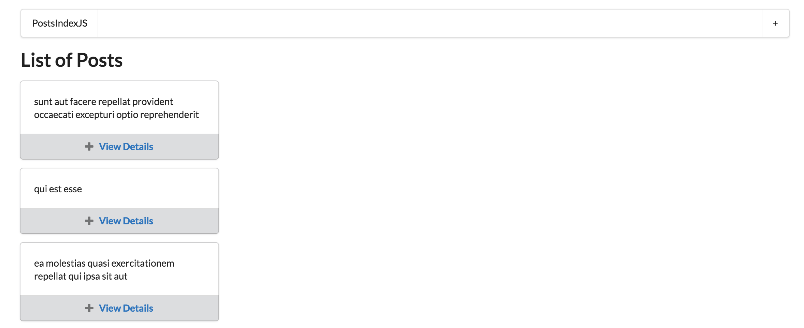

# Next.js: Posts

- Links:
  - [Next.js Crash Course - Server Side React, Traversy Media](https://www.youtube.com/watch?v=IkOVe40Sy0U)
  - [Ethereum and Solidity: The Complete Developer's Guide (Section 7), Udemy](https://www.udemy.com/ethereum-and-solidity-the-complete-developers-guide/learn/v4/content)
  - [BUILDING A BLOG WITH NEXT.JS](https://timber.io/blog/building-a-blog-with-next-js/)
  - [Semantic UI](https://semantic-ui.com)
  - [ReactJS: Conditional Rendering](https://reactjs.org/docs/conditional-rendering.html)
  - [Dynamic Routes for Next.js](https://github.com/fridays/next-routes)

## Overview
  - Minimalistic framework for rendering React apps on the server
  - Server-rendered React apps
  - Simple page based routing

## Create-react-app vs Next
  - Create-react-app
    - By default it doesn't include anything for navigation, data loading, etc

  

  - Next
    - Wraps up React and associated tools into 1 package
    - Lots of fancy features included out of the box: routing, server-side rendering, hot module reload
    - Makes it really easy to use React to make a multi-page app

  

## ComponentDidMount vs getInitialProps
  - Next doesn’t execute the ComponentDidMount method on the server. When the app is being rendered by next on the server, the ComponentDidMount method won’t be executed. So to fetch data on the server use the getInitialProps method inside of the component inside. It’s a lifecycle method that is defined exclusively and used exclusively by next.
  - The keyword static defines a class function—it’s not assigned to instances of the class. It’s assigned to the class itself so to call getInitialProps: ClassName.getInitialProps()

## Mockups
  - Index

  

  - Post Details Page

  

  - Create New Post

  

## Installation & Setup
  - npm init
  - npm install --save next react react-dom
  - npm install --save isomorphic-unfetch
  - package.json

  ```javascript
  scripts: {
    "dev": "next",
    "build": "next build",
    "start": "next start"
  }
  ```

  - pages/index.js

  ```javascript
  export default () => <div>List of Posts</div>
  ```

## Project Directory

  

## Routing

  

  - Problems/limitations with Next.js routing system: cannot be used for by default for dynamic routing, will need to next-routes (https://github.com/fridays/next-routes)
  - Dynamic Routing

  

  - next-routes
    - Install: npm install --save next-routes
    - Setup
      - routes.js, server.js
      - package.json

      ```javascript
      scripts: {
        "dev": "node server.js"
      }
      ```

    - The Router object from routes.js ( import { Router } from ‘../../routes’) allows us to programmatically redirect people from one page to another page inside the app e.g. Router.pushRoute('/');  
    - Linking
      - import { Link } from '../routes';
      - <Link route=“/“><a className=“item">Posts</a></Link>

## Shared Components
  - Create a common Layout component that will house the Header/Navbar that will be used across multiple pages

## Semantic UI
  - Install Semantic UI React: npm install --save semantic-ui-react
  - Semantic UI CSS: Add the Semantic UI CDN link to Components/Layout.js <link rel="stylesheet" href=“https://cdnjs.cloudflare.com/ajax/libs/semantic-ui/2.3.1/semantic.min.css”/>
